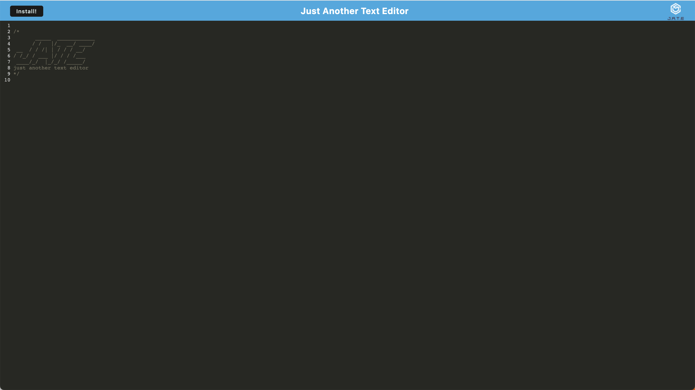
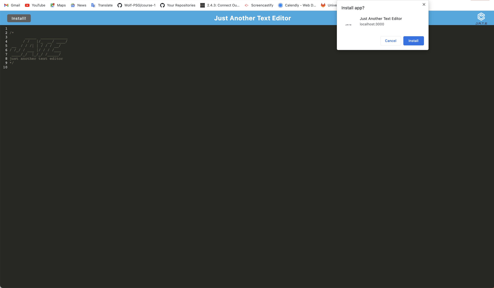
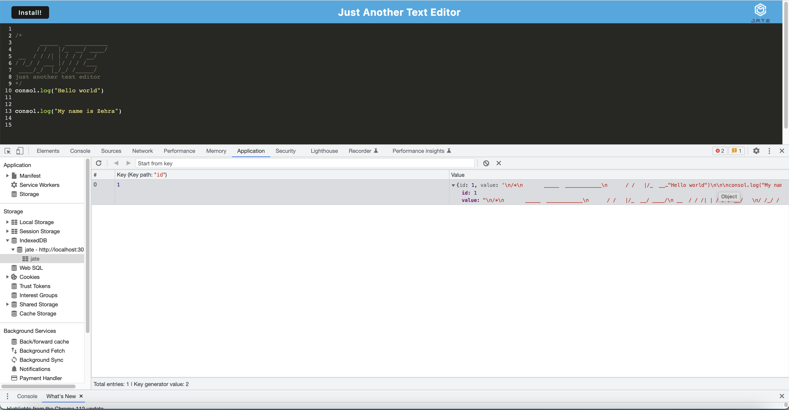
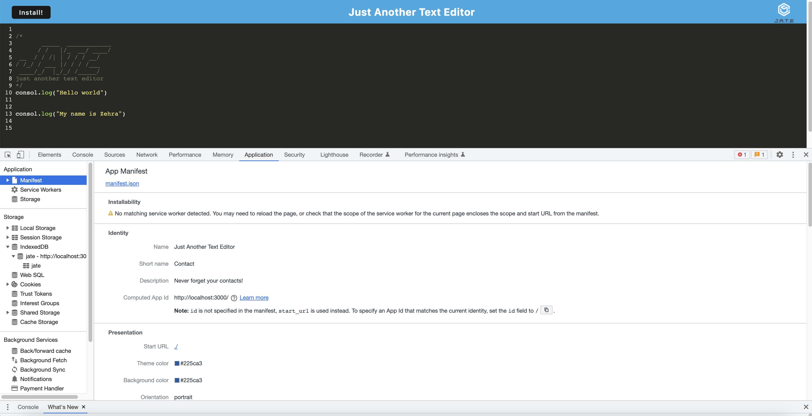
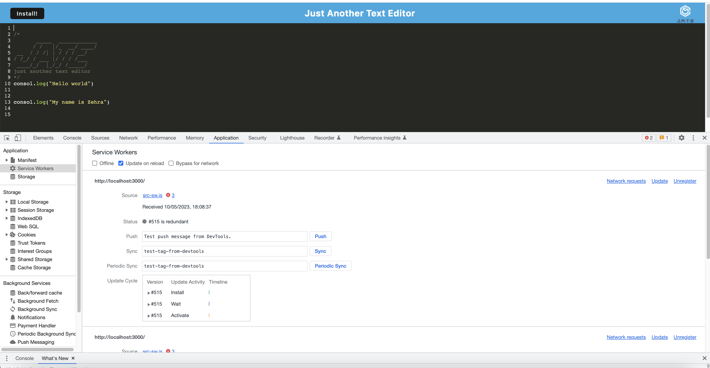

# Mini-Text-Editor

## Description

This a a text editor that runs in the browser.The app will be a single-page application that meets the PWA criteria. Additionally, it will feature a number of data persistence techniques that serve as redundancy in case one of the options is not supported by the browser. The application will also function offline.

## Installation

To install necessary dependencies, run the following command:

npm i

## Usage

To use the application from the command line (after installing dependencies):

Open the root directory of the repository in your terminal or bash.
Bundle the front-end code by entering npm run build in the command line.
Start the server by entering npm run start in the command line.

https://github.com/ZDastan/mini-text-editor

 

